# Lab 03: Automated Vulnerability Scanning with OWASP ZAP

## Overview

In this lab, I used *OWASP ZAP* (Zed Attack Proxy) to perform an automated vulnerability scan against a target web application. The goal was to understand how automated scanners work, how to interpret their findings, and how to generate a vulnerability report for stakeholders.

---

## Lab Environment

- *Operating System:* Linux
- *Target Application:* A custom vulnerable web application
- *Tools:* OWASP ZAP, Nmap, Firefox, Kali Linux

---

## Background Concepts

### What is OWASP ZAP?

ZAP is a popular open-source web application security scanner. It identifies vulnerabilities by simulating attacks and analyzing how the application responds. It supports both automated and manual testing.

### Common Vulnerabilities ZAP Detects

- SQL Injection
- Cross-Site Scripting (XSS)
- Path Traversal
- Security Misconfigurations
- Information Disclosure

### What is Path Traversal?

Path traversal is a web vulnerability where attackers manipulate file paths to access files outside the intended directory. It occurs when user input is not properly validated, allowing attackers to navigate the file system (e.g., accessing /etc/passwd on a Linux server).

---

## Lab Objectives

1. Perform an automated vulnerability scan with ZAP.
2. Analyze ZAP findings and their severity levels.
3. Confirm a vulnerability manually.
4. Generate a scan report.

---

## Methodology

### Step 1: Verify Target Availability

Pinged the target to confirm it was up. Then performed a port scan with Nmap to identify open services:

```
ping demo
```

```
nmap demo
```

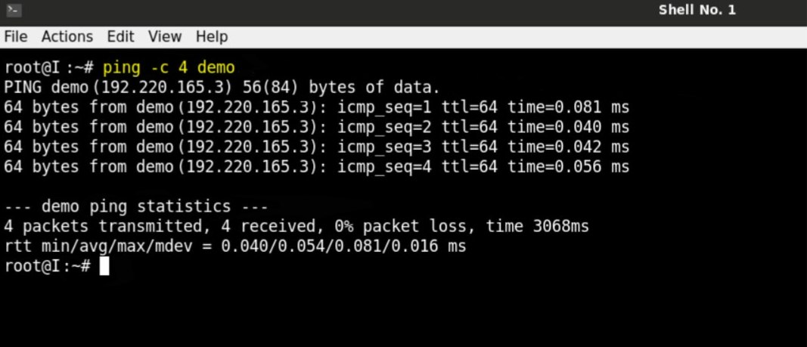

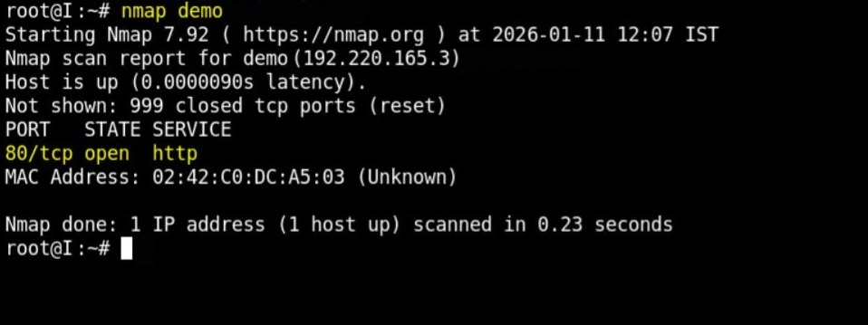

**- Port 80 (HTTP) was confirmed open -**

### Step 2: Explore the Application

Opened the application in Firefox. The application was a file viewer that allowed users to view files. Selected a file and clicked "View File" to observe normal behavior.

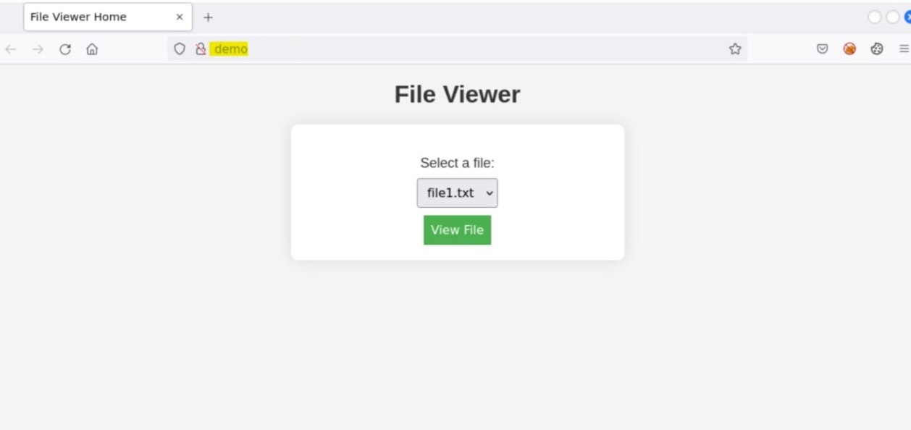

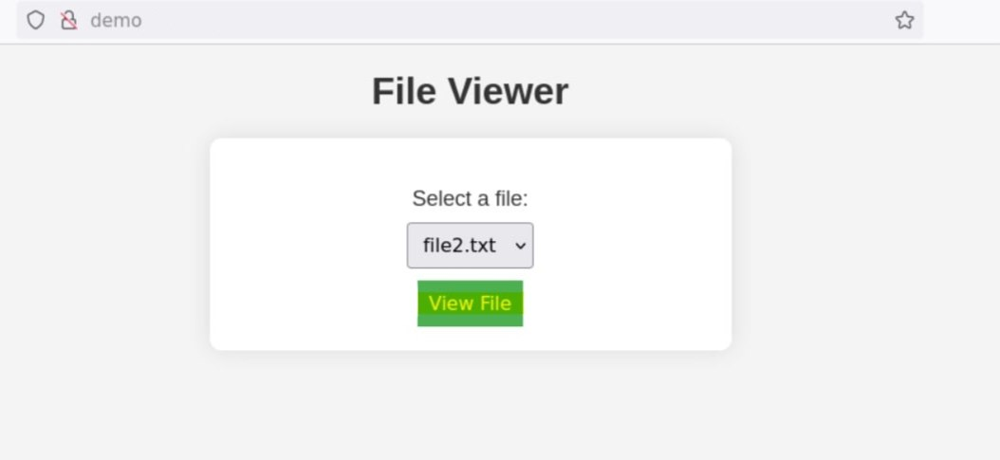

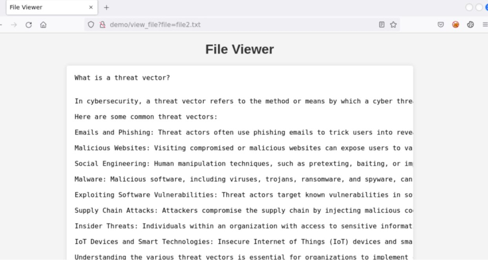

### Step 3: Launch ZAP Automated Scan

Opened OWASP ZAP and selected Automated Scan.

Entered the target URL and clicked Attack. ZAP began sending requests with various payloads, and a progress bar showed its progress.

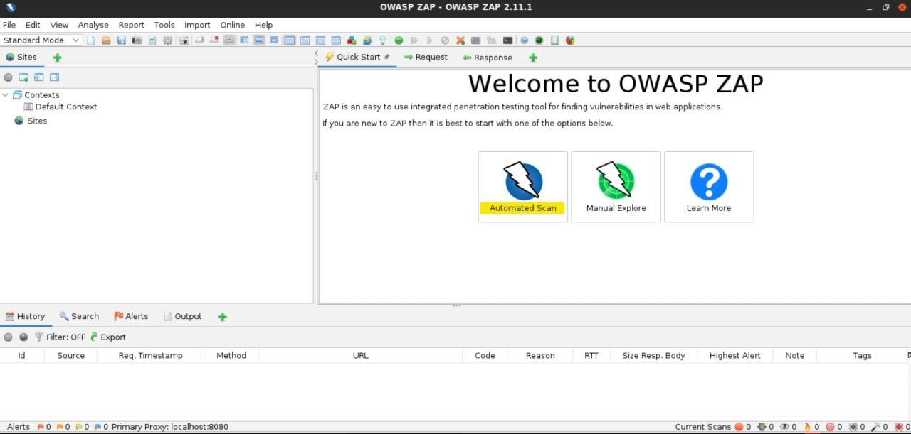

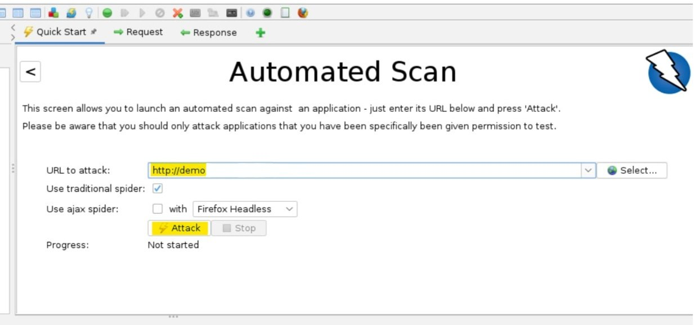


### Step 4: Analyze Alerts

Once the scan completed, ZAP displayed Alerts categorized by severity. One notable finding was Path Traversal.

Double-clicked the alert to inspect it:

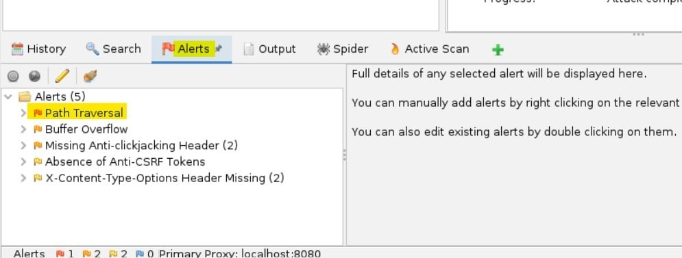

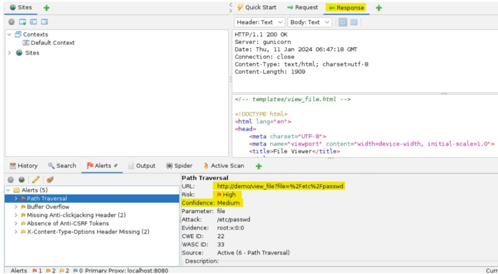

- The response body showed a status code of 200.
- The targeted URL was shown, along with the risk severity and confidence level.

### Step 5: Manually Confirm Path Traversal

Copied the targeted URL and opened it in the browser.

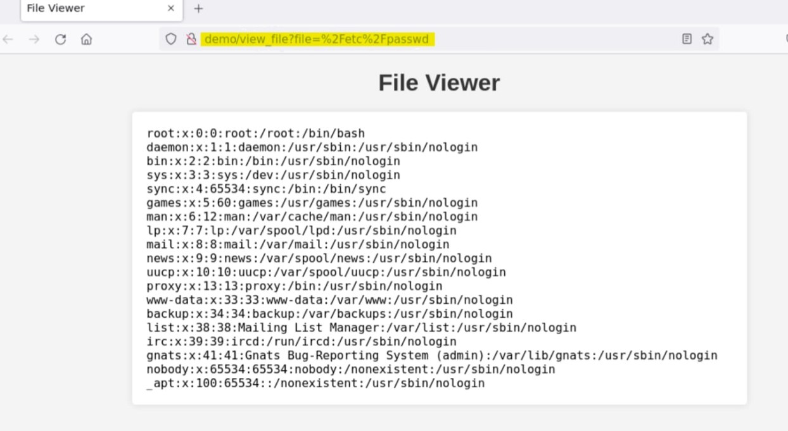

**- Result: The browser displayed the contents of /etc/passwd — confirming the Path Traversal vulnerability. -**

This demonstrated that anyone could read sensitive system files through the vulnerable parameter.

### Step 6: Generate Report

Inside ZAP, clicked the Generate Report option, then clicked Generate Report again.

A full report was generated in the browser, including:

- Summary of findings
- Vulnerability types with counts and severity
- Vulnerable endpoints and payloads used

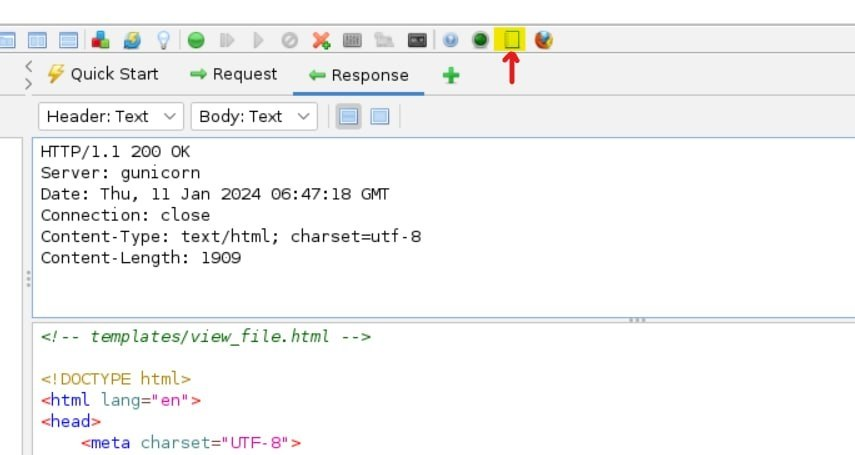

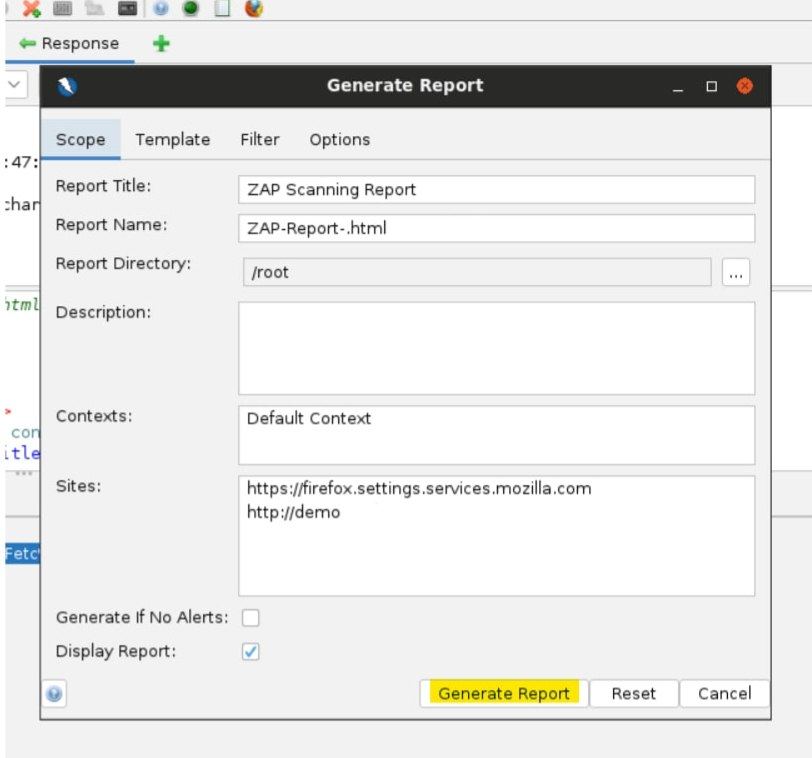

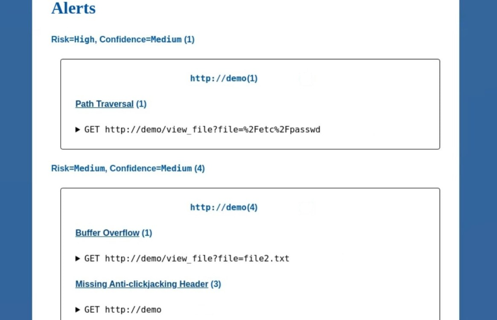

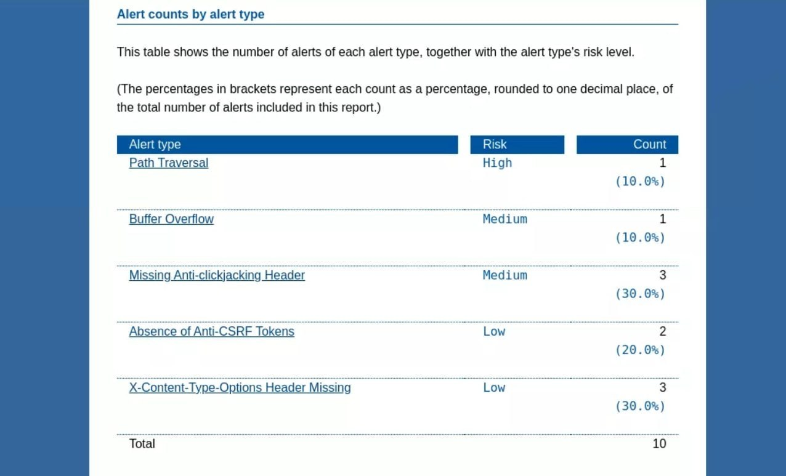

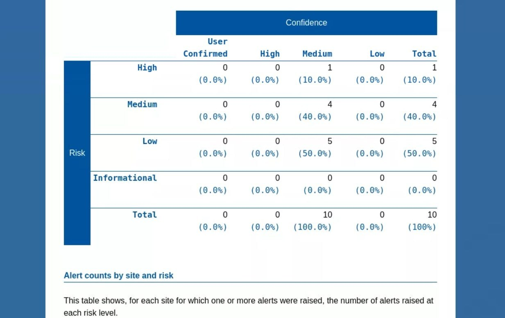

---

Key Observations

- Automated scanners like ZAP quickly identify many potential vulnerabilities.
- Manual confirmation is essential to avoid false positives.
- Path Traversal can expose critical system files if not properly validated.
- ZAP's reports are useful for communicating findings to developers and stakeholders.
- The severity and confidence ratings help prioritize remediation.

---

Lessons Learned

- Automated scanning is a valuable first step in web application security assessments.
- Tools are only as good as the analyst interpreting them — always verify findings.
- Path Traversal often results from insufficient input validation.
- Regular scanning helps identify regressions after code changes.
- Reporting is a critical skill for security analysts and consultants.

---

Mitigation for Path Traversal

- Validate all user input: Reject input containing ../ or encoded variants.
- Use a whitelist: Only allow specific files to be accessed.
- Run with least privilege: The web server should not have access to sensitive system files.
- Sanitize file paths: Use built-in functions that normalize paths and prevent traversal.

---

Tools Used

- OWASP ZAP
- Nmap
- Firefox
- Kali Linux
